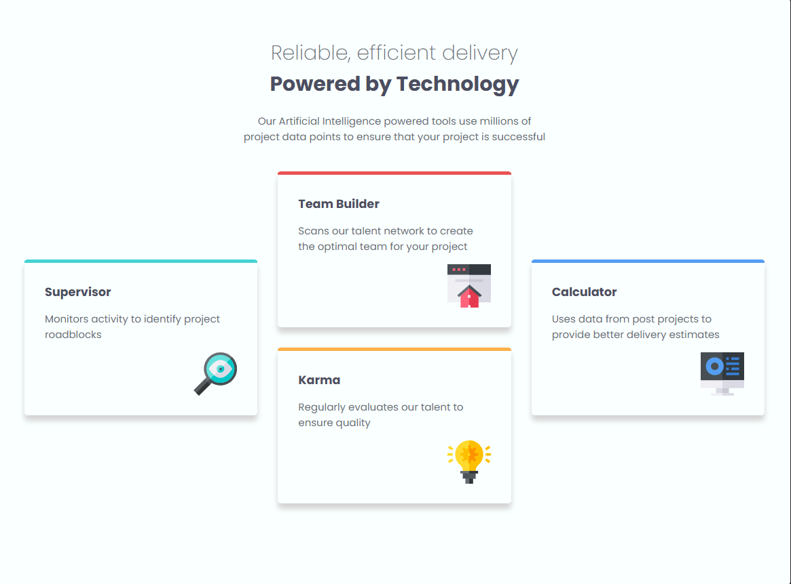
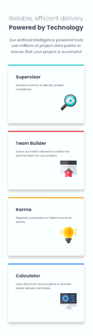

# Frontend Mentor - Four card feature section solution

This is a solution to the [Four card feature section challenge on Frontend Mentor](https://www.frontendmentor.io/challenges/four-card-feature-section-weK1eFYK). Frontend Mentor challenges help you improve your coding skills by building realistic projects. 

## Table of contents

- [Overview](#overview)
  - [The challenge](#the-challenge)
  - [Screenshot](#screenshot)
  - [Links](#links)
- [My process](#my-process)
  - [Built with](#built-with)
  - [What I learned](#what-i-learned)
  - [Continued development](#continued-development)
  - [Useful resources](#useful-resources)
- [Author](#author)

## Overview

### The challenge

Users should be able to:

- View the optimal layout for the site depending on their device's screen size

### Screenshot

### Links

- Solution URL: [https://github.com/Reyuken/practiceTemplate2](https://github.com/Reyuken/practiceTemplate2)
- Live Site URL: [https://reyuken.github.io/practiceTemplate2/](https://reyuken.github.io/practiceTemplate2/)

## My process

### Built with

- Semantic HTML5 markup
- SCSS/Sass
- Flexbox
- Grid
- CSS Media Queries
- npm and Sass CLI

### What I learned

This project helped me practice using SCSS and CSS Grid to build a responsive layout from scratch.

I learned how to use Sass nesting to organize styles and practiced creating a multi-column layout with CSS Grid.

I also practiced using:

- `grid-template-columns`
- `grid-template-rows`
- `grid-column`
- `grid-row`
- `align-self`
- `gap`
- Media queries for responsive layouts
- Flexbox for positioning content within cards
- Fixed and responsive card dimensions

Another area I practiced was positioning elements within cards, such as placing icons at the bottom-right using Flexbox and `margin: auto`.

### Continued development

I want to continue improving my SCSS and CSS layout skills, particularly with:

- Sass mixins and functions
- Partials and `@use`
- More complex CSS Grid layouts
- Combining CSS Grid and Flexbox effectively
- Responsive design and media queries
- Writing cleaner and more maintainable SCSS

I also want to practice recreating more designs from Figma and Frontend Mentor to improve my ability to translate designs into responsive websites.

### Useful resources

- [Sass Documentation](https://sass-lang.com/documentation/) - Helped me understand Sass syntax and features.
- [Frontend Mentor](https://www.frontendmentor.io/) - Used for practicing realistic frontend projects and responsive layouts.
- [MDN Web Docs](https://developer.mozilla.org/) - Used as a reference for CSS Grid, Flexbox, and CSS concepts.

### AI Collaboration

I used ChatGPT as a learning and debugging assistant during this project.

I mainly used it to:

- Understand SCSS concepts and syntax
- Debug CSS Grid and responsive layout issues
- Understand `grid-column` and `grid-row`
- Better understand Flexbox and CSS Grid
- Review my SCSS and suggest improvements
- Understand why certain CSS properties worked or didn't work

I used AI primarily to understand why something worked or didn't work rather than simply copying the solution.

### Author
Frontend Mentor - @reyuken
